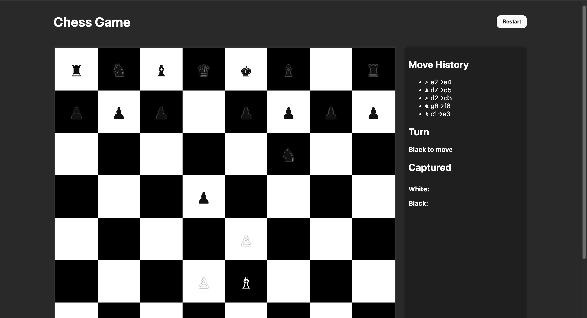

# Chess Game (HTML/CSS/JS)

Simple 2-player chess game built with **vanilla JavaScript**, fully running in the browser.  
Features:
- Full chess set with legal moves for each piece  
- Turn switching & check/checkmate detection  
- Illegal moves prevented (cannot leave king in check)  
- Move history panel  
- Captured pieces display  
- Current turn indicator  
- Drag & drop or click-to-move support  
- Restart game button  

---

## How to Run

1. **Clone repo from GitHub**  
 ```bash
   git clone https://github.com/your-username/chess-game.git
   cd chess-game
 ```

2. **Open `index.html` in your browser**  
   - Just double-click `index.html`  (or use "open with")


3. **Play!**  
   - Click or drag pieces to move  
   - Use the sidebar to see move history & captured pieces  
   - Restart game anytime with the button  

---

## Screenshot


---

## Notes
- No backend required  
- Implemented in OOP style with ES6 classes  
